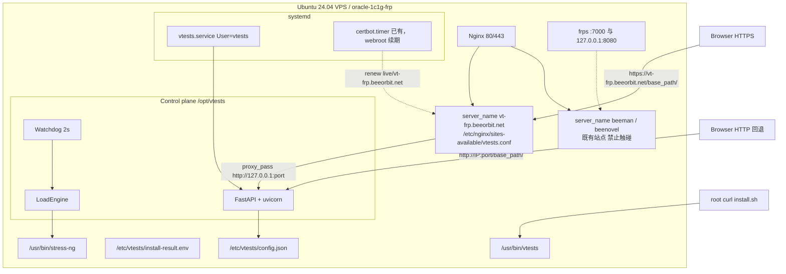
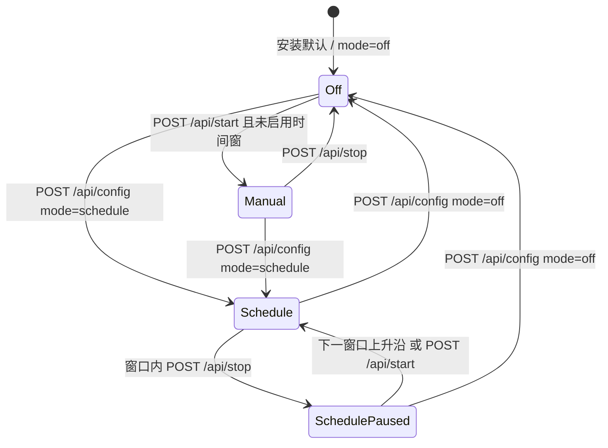
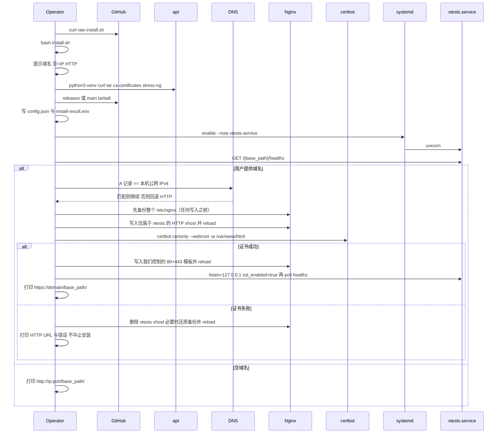

# vtests 设计文档

| 字段 | 内容 |
| --- | --- |
| 文档标题 | vtests：VPS 稳定性 / 模拟负载控制面 |
| 作者 | TBD |
| 日期 | 2026-09-02 |
| 状态 | Draft |
| 仓库 | https://github.com/minng2018/vtests |
| 原型目标 OS | Ubuntu 24.04 (noble) |
| 当前代码状态 | exploratory spike（`0.1.0`，commit `07dfcca`），**不是**冻结规格 |
| 本文地位 | 实现与评审的 source of truth；后续代码按本文重写，而不是把 spike 当成成品 |
| 修订 | 2026-09-02：v1 增加安装时可选域名 + HTTPS（`vt-frp.beeorbit.net`）。评审后改为 `certbot certonly --webroot` 自写 443 模板、CPU 服务端封顶、所有权契约、调度状态机冻结、PR 保持 `main` 可安装。试验机 smoke：**仅短测**，CPU **30%**（1 GB 硬顶）、内存 ≤64 MB、≤5 分钟。 |

---

## Overview

vtests 解决的问题是：在一台 Ubuntu VPS 上，用一条与 [3X-UI](https://github.com/MHSanaei/3x-ui) 相同体验的命令完成安装，然后通过带密码的简单 Web 页配置 **CPU 目标负载率** 和 **内存占用**，并按每天的时间窗口自动启停。现有 GitHub 项目各自只覆盖其中一块（`stress-ng` 有引擎无面板，`lookbusy` 有整机占用与 24h 曲线无 Web，`the78mole/cpu-loader` 有 Web/REST 无内存与调度，`rediculum/web_stress` 有表单但内存不完整），因此 v1 的正确形态是 **一层很薄的控制面 + 发行版自带的 stress-ng**，而不是再写一套加压内核。

控制面负责：一键安装与 systemd、随机路径与密码、配置持久化、时间窗口看门狗、安全上限、以及把用户意图翻译成一条受约束的 `stress-ng` 命令。加压本身复用 Ubuntu 24.04 universe 中的 `stress-ng` `0.17.06-1build1`。安装完成后 **不得自动加压**；在 1 vCPU / 1 GB 机器上默认以很低的 CPU/内存启动配置，并用 cgroup 与 `MemAvailable` 双重封顶，避免把系统或同居的生产进程吃光。

安装时询问一个 **已经解析到本机** 的域名。提供了域名则用本机 Nginx 的独立 `server_name` + Let's Encrypt（`certbot certonly --webroot` HTTP-01，vhost 模板由我们自己写 80+443）给面板套 HTTPS，打印 `https://<domain>/<base_path>/`；直接回车则保持 `http://<ip>:<port>/<base_path>/`。证书失败 **不得中止安装**，回退到 IP HTTP。试验机已解析域名：`vt-frp.beeorbit.net` → `158.101.29.241`。**禁止** `certbot --nginx` 改写既有站点。

---

## Background & Motivation

### 为什么要做

VPS 稳定性验证、空闲实例保活、以及“让机器在指定时段看起来有负载”是真实需求。用户要的不是基准测试套件，而是：

1. 和 3X-UI 一样的安装 UX（`curl | bash`、打印 URL + 密码、`vtests` 管理命令）。
2. 浏览器里改 CPU% 和内存占用，立刻生效。
3. 每天 `HH:MM–HH:MM` 窗口，支持跨午夜和时区。
4. 底层用成熟开源引擎，不要自己实现 busy loop。
5. 安装时可提供已解析域名，自动签发证书并以 HTTPS 发布面板；不提供则 IP:端口 HTTP。

### 现状（仓库里的 spike）

仓库当前是一次可运行的探索：

| 路径 | 角色 |
| --- | --- |
| [`install.sh`](../install.sh) | 一键安装 / 卸载 |
| [`vtests.sh`](../vtests.sh) | 管理菜单，安装到 `/usr/bin/vtests` |
| [`systemd/vtests.service`](../systemd/vtests.service) | `Type=simple`，以 **root** 跑 uvicorn |
| [`app/main.py`](../app/main.py) | FastAPI 控制面 + 调度 + `stress-ng` 子进程，518 行单体 |
| [`app/web/index.html`](../app/web/index.html) | 单页设置 UI |
| [`requirements.txt`](../requirements.txt) | `fastapi>=0.115.0`、`uvicorn>=0.32.0` |
| [`VERSION`](../VERSION) | `0.1.0` |

Spike **已经证明**这些路径走得通：

- `bash <(curl -Ls https://raw.githubusercontent.com/minng2018/vtests/main/install.sh)` 可以从 GitHub 拉源码、建 venv、装 `stress-ng`、写 `/etc/vtests/config.json`、enable systemd、打印 URL。
- 安装后 `enabled=false`、`schedule_enabled=false`，默认不加压。
- Web 页能改 CPU / 内存、手动启停、每天时间窗 + 跨午夜（`in_window()`）。
- 随机 `base_path` + 面板密码 + httponly cookie。
- 小内存主机安装时把默认值压到 CPU 10% / 内存 64 MB。
- 引擎命令形态：`stress-ng --timeout 0 --cpu 0 --cpu-load N --cpu-method nop --vm 1 --vm-bytes XM --vm-keep`。

Spike **不能当成品**，主要问题见下文「Spike 审计」。本文是重写的规格。

### 痛点

- 没有一个现成仓库同时满足安装 UX、Web、调度、CPU/内存占用和可选域名 HTTPS。
- 1 GB 机器上乱加压会 OOM、拖死同居服务、触发云厂商风控。
- 用户指定的试验机 `158.101.29.241`（`oracle-1c1g-frp`）是 **生产 FRP/Nginx 入口**，不是可以拉满的实验室。

---

## Goals & Non-Goals

### Goals（v1 必须交付）

1. **3X-UI 同款一键安装**
   ```bash
   bash <(curl -Ls https://raw.githubusercontent.com/minng2018/vtests/main/install.sh)
   ```
   脚本从 GitHub 下载、安装、enable systemd、打印面板 URL + 随机路径 + 密码。管理命令 `vtests` 提供 `status` / `start` / `stop` / `password` / `uninstall`（以及菜单）。`vtests start|stop` 控制的是 **面板服务** `vtests.service`，不是加压进程。
2. **简单 Web 设置页**：CPU 目标负载（%）、内存占用（MB）、立即开始 / 停止、每天时间窗口、时区。必须有密码；随机 URL 路径（3X-UI 的 `webBasePath` 同类物）。
3. **调度器**：每日 `HH:MM–HH:MM`，IANA 时区，跨午夜（`start > end` 视为跨天）。窗口外停止加压；窗口内按配置运行。用户在窗口内点「停止」视为 pause，下一窗口开始时自动解除。
4. **可配置 CPU 负载率与内存占用**，底层调用发行版 `stress-ng`，不重写加压内核。
5. **安装后不自动加压**。
6. **小内存与 CPU 安全上限**，按 `MemAvailable` 与机型档位封顶（1 GB：内存硬顶 128 MB、CPU 硬顶 30%），systemd `MemoryMax` / `CPUQuota` 兜底。
7. **可选域名 HTTPS（v1 必做能力，安装时可选）**：提示用户输入已解析到本机的域名；有域名则自动配置 TLS 并在该域名上以 HTTPS 提供面板；空输入则保持 IP:端口 HTTP。证书失败回退 HTTP，**不中止安装**。不得破坏本机已有 Nginx 站点（试验机上的 `beeman.beeorbit.net` / `beenovel.beeorbit.net`）。
8. 原型 OS：Ubuntu 24.04 amd64。Debian 12 / Ubuntu 22.04 可以尝试安装，但不作为 v1 验收目标。

### Non-Goals（v1 明确不做）

| 项 | 说明 |
| --- | --- |
| 磁盘 / 网络加压 | `--hdd` / `--iomix` / `--sock` / `--udp` 一律不暴露。会打满 Oracle 50 Mbps 公网、拖垮 FRP、磨损磁盘。 |
| 多主机、集群、容器编排 | 单机控制面。 |
| Windows / macOS | 目标是 Linux VPS。 |
| 精确基准测试 | `stress-ng` 官方也不把它当 benchmark。 |
| lookbusy 式 24h 余弦曲线 | v1 只做矩形时间窗；曲线模式留到以后。 |
| 每核独立百分比 | `cpu-loader` 的能力，v1 不需要。 |
| DNS-01 / IP 证书 / 把 vtests 并进既有 SAN | v1 只用 HTTP-01 给 **单独** 的面板域名签证书。不为 `158.101.29.241` 签 IP 证；不把 `vt-frp.beeorbit.net` 扩进 beeman+beenovel 那张已有证书。 |
| 面板进程自己终止 TLS（uvicorn SSL） | TLS 在 Nginx；控制面始终明文听 loopback 或随机端口。 |
| acme.sh standalone 抢 80 | 试验机 80 已被 Nginx 占用；停 Nginx 签发会中断 beeman/beenovel。v1 用已在该机运行的 **certbot certonly --webroot**，自己写 vhost。 |
| `certbot --nginx` 插件改写全树 | 插件会解析 **全部** Nginx 配置，可能改 beeman/beenovel。v1 禁止。 |
| 多用户、RBAC、审计日志中心 | 单管理员密码。 |
| 把 vtests 装到生产入口上做满载压测 | 文档必须警告；默认值必须保守。 |

---

## Spike 审计：保留什么、重写什么

### 保留（经验已经验证）

- 产品形态：控制面 + `stress-ng`，不自研 busy loop。
- 安装后默认 `enabled=false`。
- 随机 `base_path` + 面板密码。
- `in_window()` 的跨午夜算法（`start == end` 视为全天；`start < end` 半开区间；否则跨夜）。
- `--cpu-method loop`（noble `stress-ng` `0.17.06` 无 `nop`；`nop` 若出现则回退 `loop`）：低副作用地烧周期，避免 `all`/`matrixprod` 把 1 OCPU 打成热节流。
- `--vm-keep`：保持映射，满足“占用”而不是分配后立刻释放。
- `/etc/vtests/config.json` + `/etc/vtests/install-result.env`（mode 600）这对 3X-UI 同构文件。
- `GET {base_path}/healthz` 给安装脚本做就绪探测。
- 单文件 HTML，无前端构建链。
- 管理命令交互菜单 + 子命令。
- `save_config` 的 tmp + chmod + replace（spike **没有** `fsync`，v1 补上）。

### 必须改掉（不安全或错误）

| 严重度 | 问题 | 位置 | 处理 |
| --- | --- | --- | --- |
| **P0** | 控制面与 `stress-ng` 均以 **root** 运行。stress-ng 文档写明：root 下会调整 OOM，使 stressor 在低内存时 **难以被 OOM killer 杀掉**。1 GB 机器上这是自杀开关。 | [`systemd/vtests.service`](../systemd/vtests.service) `User=root`；[`LoadEngine.start`](../app/main.py) | 专用用户 `vtests`；启动 stress-ng 时加 `--no-oom-adjust --oom-avoid`。 |
| **P0** | 内存上限按 `MemTotal - 512` 计算。954 MiB 主机上封顶 ≈ 442 MB，加上已有 FRP/Nginx（该机可用内存约 550 MB）会直接 OOM。 | `max_memory_mb()` | 改成 `MemAvailable` + 机型档位硬顶（1 GB 档 ≤ 128 MB）。 |
| **P0** | `open_port()` 向 iptables `INPUT` 插 ACCEPT。试验机已有 **持久 iptables + Oracle 安全列表**；脚本既不能改安全列表，又会弄脏主机防火墙，且重启后可能丢失。 | [`install.sh`](../install.sh) `open_port()` | 默认 **不改防火墙**。打印安全组/隧道说明。仅当 `VTESTS_OPEN_FIREWALL=1` 才动 ufw。 |
| **P1** | 密码明文写在 `config.json`。 | `default_config()["password"]` | 存 `password_hash`（scrypt/argon2）；明文只出现在一次性的 `install-result.env`。 |
| **P1** | 改密码不失效已有 cookie：token 签的是 `secret` 不是密码。 | `reset_password` / `make_token` | 重置密码时轮换 `secret`。 |
| **P1** | 登录无速率限制。随机路径降低了扫描，但不够。 | `/api/login` | 每 IP 失败 N 次后 sleep / 429。 |
| **P1** | 默认监听 `0.0.0.0:8088`，端口可预测。3X-UI 默认随机 `1024–62000`。 | `default_config()` | 首次安装随机高位端口。 |
| **P1** | `stress-ng` 的 stdout/stderr 丢到 `DEVNULL`，失败时只剩 `ENGINE.error` 里的“找不到二进制”。 | `LoadEngine.start` | 日志写 `/var/log/vtests/stress-ng.log`，状态 API 返回 last lines。 |
| **P2** | 安装拉的是 `heads/main` 的 archive，不是 GitHub Releases；无校验和；与 3X-UI 的 `releases/latest` → 带版本 tarball 不一致。 | `fetch_app()` | 有 tag 时走 Releases；开发态才用 `VTESTS_BRANCH`。 |
| **P2** | `paused` / `enabled` / `schedule_enabled` 三角语义含糊；看门狗在窗口边沿改写 `enabled`。 | `Watchdog._loop` | 引入明确 `mode`，看门狗只读配置、只启停引擎。 |
| **P2** | 单体 `main.py`、无测试、无文件锁、配置读写与看门狗/API 竞态。 | 全文件 | 拆模块 + `fcntl` + 单测。 |
| **P2** | 无 systemd 硬化（`ProtectSystem`、`MemoryMax`、`NoNewPrivileges`）。 | unit | 见「systemd」一节。 |

### 明确不保留的 spike 选择

- **不要**把“安装时自动放行面板端口”当成特性。
- **不要**继续用 `MemTotal-512` 当安全模型。
- **不要**继续 root + 丢弃 stress-ng 日志。
- **不要**把 8088 写成产品默认端口。
- spike **没有** 域名 / TLS（只打 `http://ip:8088/path/`）。这是新的 v1 能力，用 `certbot certonly --webroot` + 自写 vhost 实现，不是在 spike 上打补丁。

---

## Proposed Design

### 总体架构

控制面是一个小的 Python 进程（FastAPI + uvicorn，见 Open Questions 中的 Go vs Python）。它 **不** 自己烧 CPU/内存，只做 HTTP、配置、窗口判断，然后 fork `stress-ng`。



控制面 **必须单进程**：`uvicorn.run(..., workers=1)` 或不传 `workers`（默认 1）。禁止 gunicorn/`--workers 2`。Watchdog 与 `LoadEngine` 是进程内单例，多 worker 会拉起多份 stress-ng。启动时若检测到 `UVICORN_WORKERS`>1 则拒绝启动。

### 加压语义（必须写进 UI 文案）

v1 **不** 承诺 lookbusy 那种“整机占用率闭环”。

| 用户设置 | 实际命令 | 含义 |
| --- | --- | --- |
| CPU 目标负载 N% | `--cpu 0 --cpu-load N --cpu-method nop` | 每个 CPU stressor 按 N% 占空比忙/睡。`--cpu 0` = `sysconf(_SC_NPROCESSORS_CONF)`。**不是**“整机利用率维持在 N%”。其它进程变忙时，实际利用率会高于 N%。 |
| 内存占用 X MB | `--vm 1 --vm-bytes XM --vm-keep` | 一个 vm stressor 分配并保持 X MB 匿名页。vm 工作器会持续触碰页面，**额外消耗少量 CPU**。这是“占用”而不是 `malloc` 后不管。 |

Oracle `VM.Standard.E2.1.Micro` 客人机常报告 **2 个逻辑 CPU**，但云侧只有 1/8 OCPU 可突发。`--cpu 0` 会起 2 个 worker。UI 必须显示 `cores`，并在 ≤2 GB 主机上提示“逻辑核与云侧 OCPU 不是一回事”。

若未来要“整机占用闭环 / 24h 曲线”，应接 lookbusy（GPL），而不是在控制面里重写 PID。v1 不做。

### 推荐的 stress-ng 命令

```bash
nice -n 19 ionice -c 3 /usr/bin/stress-ng \
  --timeout 0 \
  --no-oom-adjust \
  --oom-avoid \
  --oom-avoid-bytes "${OOM_AVOID}" \
  --keep-name \
  --cpu 0 \
  --cpu-load "${CPU_PERCENT}" \
  --cpu-method nop \
  --vm 1 \
  --vm-bytes "${MEMORY_MB}M" \
  --vm-keep \
  --log-file /var/log/vtests/stress-ng.log \
  --log-brief \
  --quiet
```

约束：

- CPU% 为 0 则省略 `--cpu*`；内存为 0 则省略 `--vm*`；两者都为 0 则不启动。
- `--timeout 0`：一直跑直到收到 SIGTERM/SIGKILL。
- `--no-oom-adjust`：即使将来误用 root，也不把 stressor 设成难以杀掉。
- `--oom-avoid --oom-avoid-bytes`：1 GB 档用 `128M`（不可用 256M，否则会否决默认 64 MB vm）。更大主机用 `256M` 或 `15%`。
- `nice 19` + `ionice -c 3`（idle）：真实业务优先。`ionice` 不存在则跳过。
- 禁止 `--pathological`、`--thrash`、`--ignite-cpu`、`--hdd`、`--sock`。
- 工作目录 `/var/lib/vtests`，避免在 `/opt/vtests` 或 `/` 下写临时文件。

引擎用独立进程组（`start_new_session=True`），停止时 `SIGTERM` 进程组，3s 后 `SIGKILL`。这点 spike 是对的，保留。

### 调度模型

不引入 APScheduler。每日矩形窗口用 in-process watchdog 即可（周期 2s，CPU 可忽略）。APScheduler 对 cron 表达式和任务持久化有价值，v1 用不上。



配置字段（冻结，不再有「或者」）：

```json
"mode": "off" | "manual" | "schedule"
"paused_until_next_window": false
```

`should_run(cfg, now)` **唯一** 定义：

1. `mode == "off"` → 否
2. `paused_until_next_window == true` → 否（任何 mode）
3. `mode == "manual"` → 是
4. `mode == "schedule"` → `in_window(cfg, now)`（跨午夜规则与 spike 相同）

看门狗 **只读配置、只启停引擎**，不写 `enabled`。仅允许的写回：`in_window` 从 false→true 的上升沿时，若 `paused_until_next_window` 为真则清为 false 并 `save_config`（下一窗口自动恢复）。

API 语义（删除「或把 mode 设为 off」分叉）：

| 调用 | 效果 |
| --- | --- |
| `POST /api/stop` 且当前 `mode==schedule`（含已 pause） | 设 `paused_until_next_window=true`，**保持** `mode=schedule`，`engine.stop` |
| `POST /api/stop` 且 `mode!=schedule` | `mode=off`，清 pause，`engine.stop` |
| `POST /api/start` 且 `mode==schedule` | 清 pause，**保持** `mode=schedule`；若当前 `in_window` 则 `engine.start`，否则等窗口 |
| `POST /api/start` 且 `mode!=schedule` | `mode=manual`，清 pause，立即 `engine.start`。**不得** 因 leftover pause 把 `off` 提升成 `schedule` |
| `POST /api/config` 的 `mode` | 用户开关时间窗的唯一途径：`schedule` / `off` / `manual` |

UI：「已暂停到下一时间段」。

时区用 `zoneinfo.ZoneInfo`，非法值拒绝保存，运行时回退 UTC 并在 status 里报警。

`start == end`：v1 定义为 **全天运行**（与 spike 一致），UI 提示“开始等于结束表示全天”。

### 1 vCPU / 1 GB 资源预算

以试验机 `oracle-1c1g-frp`（[`/home/min/work/vps/oracle-1c1g-frp.md`](/home/min/work/vps/oracle-1c1g-frp.md)）实测为下限：

| 项目 | 数量 |
| --- | --- |
| 云规格 | `VM.Standard.E2.1.Micro`。Always Free 保证份额是 **1/8 OCPU 可突发** + 1 GB RAM + 公网约 50 Mbps。库存文档写「Cloud allocation: 1 OCPU」指的是 **shape 名称**，不是保证算力；实现时按 1/8 OCPU 预算，不要按满 OCPU 加压。 |
| 客人 `MemTotal` | ≈ 954 MiB |
| 部署 FRP 0.71.0 + Nginx + 2 GiB swap 后 `MemAvailable` | ≈ 550 MiB（2026-08-17） |
| swap | `/swapfile` 2 GiB，`vm.swappiness=10` |
| 已占用公网端口 | `22` / `80` / `443` / `7000`；`8080` 仅 loopback（frps HTTP vhost） |
| 同居生产流量 | `beeman.beeorbit.net`、`beenovel.beeorbit.net` |

控制面目标：

| 进程 | RSS 目标 | 说明 |
| --- | --- | --- |
| `uvicorn` + FastAPI | **≤ 80 MiB**（告警 100 MiB） | 无 WebSocket、无 ORM、无科学计算库 |
| `stress-ng` 主进程 + cpu workers | ≈ 5–15 MiB | `--cpu-method nop` |
| `stress-ng` vm | ≈ `memory_mb` | 计入占用 |
| 安装时 pip | 峰值可能 80–150 MiB | 只用 wheel（fastapi/uvicorn 有 wheel），禁止现场编译 |

**安全上限算法**（替换 spike 的 `total-512`）：

```python
def max_memory_mb(total_mb: int, avail_mb: int) -> int:
    # 永远给系统和同居服务留出余量
    reserve = max(256, int(total_mb * 0.30))
    if total_mb <= 1536:
        reserve = max(reserve, 384)
        hard_ceiling = 128
    elif total_mb <= 4096:
        hard_ceiling = min(1024, int(total_mb * 0.40))
    else:
        hard_ceiling = int(total_mb * 0.50)
    from_avail = max(0, avail_mb - reserve)
    from_total = max(0, total_mb - reserve)
    return max(0, min(hard_ceiling, from_avail, from_total))
```

在 954 / 550 的机器上：`reserve=384`，`hard_ceiling=128`，`from_avail=166` → **上限 128 MB**。若当时 `avail_mb=300`：`from_avail=0` → **上限 0 MB**，UI 必须写「内存紧张，仅允许 CPU」，`LoadEngine` 省略 `--vm*`。

默认值另取更低，且 **CPU 同样服务端封顶**（与内存同一套 `LoadEngine` 路径，被盗 cookie 不能拉到 100%）：

```python
def max_cpu_percent(total_mb: int) -> int:
    if total_mb <= 1536:
        return 30
    if total_mb <= 4096:
        return 80
    return 100
```

保存与启动时：`cpu_percent = min(requested, max_cpu_percent)`，`memory_mb = min(requested, max_memory_mb)`。UI 滑条 `max` 绑这两个值，并在触及封顶时提示，而不是假装写入了 100%。

| 档位 `MemTotal` | 默认 CPU% | CPU 硬顶 | 默认 memory_mb | 硬顶 memory_mb | `--oom-avoid-bytes` |
| --- | --- | --- | --- | --- | --- |
| ≤ 1536 MB | 10 | **30** | 64 | 128 | 128M |
| ≤ 4096 MB | 20 | 80 | 128 | 40% 与上式 | 256M |
| > 4096 MB | 20 | 100 | 256 | 50% 与上式 | 256M |

UI 在 ≤1536 MB 且用户把滑条拉到硬顶时警告：「可能影响本机其它服务 / 触发 OOM / 云厂商突发策略」。`nice 19` **不是** 安全控制，只是让路。

`MemoryMax` **按安装时公式生成**，禁止全机型写死 240M：

```
MemoryMax = (100 + max_memory_mb + 64)M
CPUQuota  = 100%   # 仅 MemTotal ≤ 1536：1.0 CPU 总闸
```

systemd `CPUQuota=100%` 表示 **1 个 CPU 的配额**，不是「比 30% 硬顶略高」。本机客人常报 2 逻辑核；`--cpu 0` 在 30% 硬顶下约 2×0.30 = 0.6 CPU，加上 uvicorn，需要约 0.7–0.8 CPU。`100%` 容纳这些 worker，同时禁止打满 2 核。不要把 40% 写成「给 uvicorn 留余量」——那会把总配额裁到 0.4 CPU，反而卡住控制面。

1 GB 档：`100+128+64 = 292M`（uvicorn 常驻按 100 MiB 计，stress-ng 开销 ≥64M，不再用 32M slack）。≥4 GB 且 `max_memory_mb` 更大时按同一公式写 drop-in `/etc/systemd/system/vtests.service.d/limits.conf`。以后若 `max_memory_mb` 因内存变化而变，**仅** root 的 `install.sh` / `vtests` CLI 重写该 drop-in 并 `daemon-reload`（`POST /api/config` 以 `User=vtests` 运行，写不了 `/etc/systemd`）。下次 unit 重启生效。

cgroup 因 `MemoryMax` 杀掉 stress-ng（SIGKILL）时，`LoadEngine` 必须把 `error` 设为 `cgroup OOM / MemoryMax` 并打 `event=engine_fail`；不能让 `error` 留空。

延迟目标：设置页保存 / 启停 API p99 < 200 ms（不含 stress-ng 冷启动）。stress-ng 拉起应在 2s 内被看门狗或 API 看到 `alive()`。状态轮询 2s 一次，可接受。

### 模块拆分（替换单体 `app/main.py`）

```
app/
  __init__.py
  main.py          # FastAPI app、lifespan、uvicorn 入口
  config.py        # 路径、默认值、校验、原子写、文件锁
  auth.py          # scrypt 哈希、cookie HMAC、登录限速
  engine.py        # 组装命令、Popen、stop、tail log
  scheduler.py     # in_window、should_run、Watchdog
  metrics.py       # /proc/stat、/proc/meminfo、loadavg
  web/
    index.html
nginx/
  vtests.conf.template
tests/
  test_tls_policy.bats
  fixtures/certbot-certificates-beeman.txt
  test_scheduler.py
  test_config_caps.py
  test_engine_cmd.py
  test_auth.py
```

本地开发：`VTESTS_CONFIG` 指向仓库 `data/config.json`，不写 `/etc`。spike 这条已经有，保留。

### 安装与生命周期（3X-UI 对标）

3X-UI 的真实流程（[`MHSanaei/3x-ui/install.sh`](https://github.com/MHSanaei/3x-ui/blob/master/install.sh)）是：

1. `bash <(curl -Ls https://raw.githubusercontent.com/MHSanaei/3x-ui/master/install.sh)`
2. `resolve_latest_tag`：先跟 `releases/latest` 的 HTTP 重定向（避开未认证 API 60 req/h），失败再走 GitHub API。
3. 下载 `x-ui-linux-$(arch).tar.gz`。
4. 安装 systemd unit，`/usr/bin/x-ui` 管理脚本。
5. 随机用户名 / 密码 / `webBasePath` / 端口（非交互默认 `shuf -i 1024-62000`）。
6. 写 `/etc/x-ui/install-result.env` mode 600。
7. 打印 Access URL。

vtests 对齐 3X-UI 的下载 / 随机凭据 / `install-result.env`，SSL 则 **不** 复制 3X-UI 的 acme.sh standalone（会抢 80）。域名模式改走本机 Nginx + certbot，见下一节。



路径约定：

| 路径 | 用途 |
| --- | --- |
| `/opt/vtests/` | 应用、venv、`VERSION`、嵌入一份 `install.sh` |
| `/opt/vtests/venv/` | Python 虚拟环境 |
| `/etc/vtests/config.json` | 运行配置，`0600`，属主 `vtests:vtests` |
| `/etc/vtests/install-result.env` | 给人和 cloud-init 看的 URL/密码，`0600` root |
| `/var/lib/vtests/` | 工作目录 |
| `/var/log/vtests/` | 控制面与 stress-ng 日志 |
| `/usr/bin/vtests` | 管理脚本（来自 `vtests.sh`） |
| `/etc/systemd/system/vtests.service` | unit |
| `/etc/nginx/sites-available/vtests.conf` | **仅** 面板域名 vhost；带 `managed-by: vtests` 标记 |
| `/etc/nginx/sites-enabled/vtests.conf` | 上述软链 |
| `/etc/letsencrypt/live/<panel-domain>/` | certbot 为面板域名签发的 **独立** 证书 |
| `/etc/sudoers.d/vtests` | **不需要**（面板不经 sudo 启停 load） |

`install.sh` 行为：

- 必须 root。
- `detect_os`：非 Debian 系直接退出；Ubuntu != 24.04 警告后继续。
- `apt-get install -y python3 python3-venv python3-pip curl tar ca-certificates tzdata stress-ng`。`tzdata` 供 `ZoneInfo("Asia/Shanghai")`。`stress-ng` 在 universe，若失败则提示 `add-apt-repository universe`。
- 下载策略：
  1. 若参数是版本 tag（`v0.2.0`）或空且存在 GitHub Release：下载 `https://github.com/minng2018/vtests/releases/download/${tag}/vtests-${tag}.tar.gz`，校验 SHA-256（checksums 文件放在 Release）。
  2. 否则 `VTESTS_BRANCH`（默认 `main`）的 source archive。这是 v0.1 现状，发布流程建立前允许。
  3. 失败则试 `https://ghproxy.net/` 前缀（spike 已有，保留）。
  4. `fetch_app` 必须复制 `app/`、`systemd/`、`nginx/`、`requirements.txt`、`VERSION`、`vtests.sh`、`install.sh`（spike 漏了 `nginx/`，TLS 模板否则装不上）。
- **禁止** 在升级时覆盖已有 `config.json`（端口、路径、密码、调度保留）。
- 首次安装：随机 `port ∈ [1024, 62000]` 且 `ss` 检测未占用；避开 `22/80/443/7000/8080`。随机 `base_path` 长度 8–12 urlsafe。随机密码 12 字节 urlsafe。
- `MemTotal ≤ 1536` 时强制默认 CPU 10 / 内存 64，且 `mode=off`。
- enable 并 start `vtests.service`（面板），**不** start load。
- 就绪：最多 **20 秒** 轮询 `http://127.0.0.1:${port}${base_path}/healthz`（1 GB 上 FastAPI 冷导入可能超过 spike 的 8 秒）。
- 域名提示与 TLS：见「域名与 HTTPS」。成功则打印 HTTPS URL；否则打印 HTTP URL。
- 打印（IP 模式）：
  ```
  面板地址: http://<ip>:<port><base_path>/
  密码:     ****
  管理命令: vtests
  默认不会加压。请在云安全组放行端口，或：
    ssh -L <port>:127.0.0.1:<port> ubuntu@<ip>
  ```
- 打印（域名 HTTPS 成功，试验机示例）：
  ```
  面板地址: https://vt-frp.beeorbit.net/<base_path>/
  本机备用: http://127.0.0.1:<port>/<base_path>/
  密码:     ****
  管理命令: vtests
  证书:     /etc/letsencrypt/live/vt-frp.beeorbit.net/
  续期:     复用本机 certbot.timer，不要另开 timer
  默认不会加压。
  ```
- 卸载：`systemctl stop/disable`，停 load，删 `/opt/vtests`、`/etc/vtests`、unit、`/usr/bin/vtests`、`/var/lib/vtests`、`/var/log/vtests`。TLS 清理见「卸载与既有站点隔离」。**不** 回滚用户手工改过的 iptables/安全组，**不** 动 beeman/beenovel 的 Nginx 文件与证书。

环境变量：

| 变量 | 作用 |
| --- | --- |
| `VTESTS_REPO` | 默认 `minng2018/vtests` |
| `VTESTS_BRANCH` | 默认 `main`，仅 source-archive 模式 |
| `VTESTS_PORT` | 覆盖随机端口（非交互/测试） |
| `VTESTS_PASSWORD` | 覆盖随机密码 |
| `VTESTS_WEB_BASE_PATH` | 覆盖随机路径 |
| `VTESTS_LISTEN` | IP 模式默认 `0.0.0.0`；域名 TLS 成功后强制改成 `127.0.0.1`。手动设 `127.0.0.1` 则只走隧道 |
| `VTESTS_OPEN_FIREWALL` | `1` 才尝试 ufw allow；默认不改。**域名模式必须跳过**（用已开的 80/443）。本试验机不用 ufw、用持久 iptables + Oracle 安全列表，即使设了 1 也不要改 iptables |
| `VTESTS_NONINTERACTIVE` | `1` 或 stdin 非 TTY 时不 prompt（对标 3X-UI `XUI_NONINTERACTIVE`） |
| `VTESTS_DOMAIN` | 面板域名。非交互下空/未设 = IP HTTP。试验机：`vt-frp.beeorbit.net`。升级时若当前 `ssl_enabled=false` 且本变量非空，必须走 `enable_tls()` |
| `VTESTS_ACME_EMAIL` | 可选 Let's Encrypt 账户邮箱；空则 `--register-unsafely-without-email` |
| `VTESTS_TLS_DRY_RUN` | `1` 时写 HTTP vhost、对夹具树 `nginx -t`，**不** 调 Let's Encrypt（CI / 容器） |

### 域名与 HTTPS

这是 v1 功能，不是可选项。安装流程必须实现；用户可以在提示处留空，从而走 IP HTTP。

#### 安装提示（交互 vs 非交互）

对标 3X-UI 的 `XUI_NONINTERACTIVE` / `XUI_DOMAIN`：

```text
请输入已解析到本机公网 IPv4 的域名
（直接回车 = 使用 IP:端口 HTTP，不申请证书）:
```

| 模式 | 域名从哪来 | 空值含义 |
| --- | --- | --- |
| 交互（stdin 是 TTY 且未设 `VTESTS_NONINTERACTIVE=1`） | `read -rp` 上述提示 | 回车 → IP HTTP |
| 非交互（无 TTY，或 `VTESTS_NONINTERACTIVE=1`） | 只读 `VTESTS_DOMAIN`，**不再阻塞** | 未设或空 → IP HTTP |

试验机无人值守示例：

```bash
VTESTS_NONINTERACTIVE=1 VTESTS_DOMAIN=vt-frp.beeorbit.net \
  bash <(curl -Ls https://raw.githubusercontent.com/minng2018/vtests/main/install.sh)
```

校验：

- 去空白、转小写。
- 必须像域名：`^[a-z0-9]([a-z0-9-]*[a-z0-9])?(\.[a-z0-9]([a-z0-9-]*[a-z0-9])?)+$`，至少一节点。
- 拒绝 IP 字面量、`localhost`、含路径/协议的字符串。非法输入：交互可再问一次，第二次仍非法则警告并走 IP HTTP；非交互直接走 IP HTTP。都不中止安装。

#### DNS 预检

在碰 Nginx / certbot 之前：

1. 用与安装脚本相同的 `public_ip()` 得到本机公网 IPv4（`ifconfig.me` / `api.ipify.org` / `hostname -I`）。试验机期望 `158.101.29.241`。
2. `getent ahostsv4 "$domain"`（或 `dig +short A`）得到 A 记录集合。
3. **通过条件**：集合中 **含有** 本机公网 IPv4。允许额外的 A 记录（CDN 前不要用 HTTP-01，但多 A 且包含本机时仍可试）。
4. 若存在 AAAA：打印警告「检测到 IPv6，HTTP-01 可能被 LE 走 AAAA；请保证 AAAA 也指向本机或不要发布 AAAA」。**不** 因 AAAA 单独失败。
5. 失败处理：

| 情况 | 行为 |
| --- | --- |
| NXDOMAIN / 空 A | 警告「域名未解析」，**不申请证书**，继续 IP HTTP |
| A 记录存在但不含本机 IP | 警告「解析到 X，本机是 Y」，**不申请证书**，继续 IP HTTP |
| `getent`/`dig` 不可用 | 装 `dnsutils` 非必须；失败则用 `python3 -c 'import socket; print(socket.getaddrinfo(...))'`。仍失败则跳过证书 |

DNS 失败 **不是** 安装失败（exit 0 路径仍打印 HTTP URL）。

#### 证书工具：`certbot certonly --webroot`（选用）而不是 `--nginx` 插件或 acme.sh

`certbot --nginx` 会解析 **全部** Nginx 配置并改写它认为匹配的 `server` 块；解析混淆时会碰到相邻的 beeman/beenovel。回滚只删 `vtests.conf` **还原不了** 那些文件。因此 v1 **禁止** `--nginx` 插件。

| 方案 | 与试验机的关系 | 结论 |
| --- | --- | --- |
| **`certbot certonly --webroot -w /var/www/html` + 自写 80/443 模板（选用）** | 该机已有 `certbot.timer` 与 `/var/www/html`。HTTP-01 只读写 challenge 目录；**任何** `server` 字节都来自 `nginx/vtests.conf.template`。 | **v1** |
| `certbot --nginx` 或 `certonly --nginx` | 插件改全树；失败无法精确还原 beeman | **禁止** |
| acme.sh standalone（3X-UI） | 抢 80，必须停 Nginx | 拒绝 |
| acme.sh webroot | 能用，但与现有 certbot 双栈 | 不用 |
| DNS-01 | 要 DNS API 密钥 | v1 不做 |
| uvicorn `--ssl-certfile` 听 443/8088 | 443 已被 Nginx；8088 不在安全列表 | 不用 |

`setup_tls()` 是普通函数，**内部不得 `exit`**；任何失败 `return 1`。安装主流程必须写成 `setup_tls || tls_fallback`（在 `set -euo pipefail` 下否则会中止整个安装）。

缺包策略：

```bash
need_pkg() { dpkg -s "$1" >/dev/null 2>&1 || command -v "$2" >/dev/null; }
# 仅当二进制不存在才安装；禁止升级正在跑的 nginx/certbot（apt 升级可能 maintainer restart，打断 beeman）
if ! command -v nginx >/dev/null; then
  apt-get install -y --no-upgrade nginx || return 1
fi
if ! command -v certbot >/dev/null; then
  apt-get install -y --no-upgrade certbot || return 1
fi
# 不安装 python3-certbot-nginx（用不到插件）
```

签发（HTTP vhost 已 reload、webroot 可写之后）：

```bash
certbot certonly --webroot \
  -w /var/www/html \
  --non-interactive --agree-tos \
  --keep-until-expiring \
  --cert-name "${domain}" \
  -d "${domain}" \
  ${VTESTS_ACME_EMAIL:+--email "$VTESTS_ACME_EMAIL"} \
  ${VTESTS_ACME_EMAIL:- --register-unsafely-without-email}
```

硬性约束：

- **禁止** `--nginx`、`--apache`、`--expand`。
- **禁止** 把 `vt-frp.beeorbit.net` 扩进 beeman+beenovel 那张 SAN。独立 `--cert-name` = 面板域名。
- **禁止** `certbot delete` 任何 domains 集合含 `beeman.beeorbit.net` 或 `beenovel.beeorbit.net` 的 lineage。
- **任何 vhost 写入之前**：`cp -a /etc/nginx "/var/backups/vtests-nginx-$(date +%Y%m%d%H%M%S)"`（在写 HTTP vhost、reload、certbot 之前）。异常时 **先** 把 `/etc/nginx` 从该备份还原，再 `nginx -t && reload`，不要只删 `vtests.conf`。备份是「未写入 vtests 之前」的整树，还原后不会把半成品 vhost 带回来。备份保留最近 3 份，卸载时不删（占用很小）；也可只在本次失败后删本次备份。

#### 如何发布 TLS、如何不撞车

三种候选：

| 方案 | 试验机影响 | 结论 |
| --- | --- | --- |
| **A. 新增 Nginx `server_name vt-frp.beeorbit.net`，反代 `http://127.0.0.1:<panel-port>`，TLS 在 443（选用）** | 80/443 已在 Oracle 安全列表与持久 iptables 中放行。与 beeman/beenovel 靠 `server_name` 分流，不改它们的 `root`/`proxy_pass`。面板改为 loopback，随机端口不必对公网开放。 | **v1 推荐** |
| B. 面板在 8088 上自己做 TLS | 8088 **未** 出现在安全列表；公网打不开。URL 带端口。和「域名 HTTPS」的直觉不符。 | 不用 |
| C. 改默认 443 server，把所有未知 Host 转到面板 | 可能劫持没匹配到的请求；续期/排错会碰到既有站点 | 拒绝 |

试验机当前布局（[`oracle-1c1g-frp.md`](/home/min/work/vps/oracle-1c1g-frp.md)）：

| 监听 | 进程 | 用途 |
| --- | --- | --- |
| `0.0.0.0:80` | Nginx | ACME + HTTP→HTTPS |
| `0.0.0.0:443` | Nginx | `beeman.beeorbit.net`、`beenovel.beeorbit.net` |
| `0.0.0.0:7000` | frps | FRP 控制 |
| `127.0.0.1:8080` | frps | HTTP vhost，Nginx 反代到 NAS |

vtests **只** 增加一个 `server_name`。不改 7000、不改 8080、不改另外两个 `server_name`。

若安装时发现 80/443 被 **非 Nginx** 占用（例如另一台机上的 x-ui/Xray）：打印错误，跳过 TLS，走 IP HTTP。不尝试杀掉占用者。

若 `/etc/nginx/sites-enabled/*` 里已经有相同 `server_name`：跳过 TLS，不覆盖别人的 vhost。

仓库模板：`nginx/vtests.conf.template`。安装时替换 `__DOMAIN__`、`__PANEL_PORT__`、`__LISTEN_IPV6__`（见下）。**vhost 的每一个字节都由我们写入**，certbot 不得改这个文件。

IPv6：若 `ip -6 addr show scope global` 无地址，或一段只含 `[::]:80` 的 `nginx -t` 失败，则 **省略** `listen [::]`。切勿 `default_server`。启用后 `diff` 备份与当前 `/etc/nginx/sites-enabled/` 中 **非** `vtests.conf` 的文件，必须为空差；否则视为异常，整树还原备份。

分两步写配置（证书还不存在时不能 listen 443）：

**步骤 1 — 仅 HTTP**（供 webroot 挑战）：

```nginx
# managed-by: vtests
# vtests-domain: __DOMAIN__
server {
    listen 80;
    # __LISTEN_IPV6_80__  有全局 IPv6 时为 listen [::]:80; 否则空
    server_name __DOMAIN__;

    location ^~ /.well-known/acme-challenge/ {
        root /var/www/html;
        default_type text/plain;
    }

    location / {
        proxy_pass http://127.0.0.1:__PANEL_PORT__;
        proxy_http_version 1.1;
        proxy_set_header Host $host;
        proxy_set_header X-Real-IP $remote_addr;
        proxy_set_header X-Forwarded-For $proxy_add_x_forwarded_for;
        proxy_set_header X-Forwarded-Proto $scheme;
        proxy_set_header Connection "";
    }
}
```

`ln -s` 到 `sites-enabled`、`nginx -t && systemctl reload nginx`。然后 `certbot certonly --webroot`。

**步骤 2 — 证书成功后**用同一模板写出 **80+443**（我们自己加 redirect 与 `ssl_certificate`，不让 certbot 改文件）：

```nginx
# managed-by: vtests
# vtests-domain: __DOMAIN__
server {
    listen 80;
    server_name __DOMAIN__;
    location ^~ /.well-known/acme-challenge/ {
        root /var/www/html;
        default_type text/plain;
    }
    location / { return 301 https://$host$request_uri; }
}
server {
    listen 443 ssl;
    # __LISTEN_IPV6_443__
    server_name __DOMAIN__;
    ssl_certificate     /etc/letsencrypt/live/__DOMAIN__/fullchain.pem;
    ssl_certificate_key /etc/letsencrypt/live/__DOMAIN__/privkey.pem;
    include /etc/letsencrypt/options-ssl-nginx.conf;
    ssl_dhparam /etc/letsencrypt/ssl-dhparams.pem;  # 文件不存在则省略此行

    location / {
        proxy_pass http://127.0.0.1:__PANEL_PORT__;
        proxy_http_version 1.1;
        proxy_set_header Host $host;
        proxy_set_header X-Real-IP $remote_addr;
        proxy_set_header X-Forwarded-For $proxy_add_x_forwarded_for;
        proxy_set_header X-Forwarded-Proto https;
        proxy_set_header Connection "";
    }
}
```

若 `options-ssl-nginx.conf` 不存在（未装 nginx 插件包），内嵌一组保守 `ssl_protocols`/`ssl_ciphers`，不要为此去 `apt install python3-certbot-nginx`。

#### 证书失败回滚（安装继续）

`setup_tls()` 失败时安装脚本 **exit 0** 进入 HTTP 收尾：

1. 写入前已做过整树备份（见硬性约束）。回滚只还原 **那份写入前快照**，不要在已经写过 vhost 之后再备份。
2. `nginx -t` 失败 → 还原备份，**不要** reload 坏配置。
3. `certbot` 非 0 或后续 `nginx -t` 失败 → 还原 `/etc/nginx` 备份；删 `vtests.conf` 及其 enabled 链；仅当 cert-name 的 domains **等于** `{panel domain}` 时才 `certbot delete --cert-name "$domain" --non-interactive`。
4. `systemctl reload nginx`。
5. `ssl_enabled=false`，`listen` 保持 `0.0.0.0`。
6. **强制** 探测生产站点。客人 `10.0.1.87` 对公网 IP `158.101.29.241` 通常 **不能 hairpin**，因此 **禁止** 直接 `curl https://beeman.beeorbit.net/`。一律 IPv4 + SNI + 打到本机 Nginx：
   ```bash
   probe() {
     local host=$1
     curl -4 -fsS -o /dev/null -w '%{http_code}' --max-time 10 \
       --resolve "${host}:443:127.0.0.1" "https://${host}/"
   }
   probe beeman.beeorbit.net
   probe beenovel.beeorbit.net
   ```
   安装前各测一次作 **基线**；TLS 步骤后各测一次。**仅当基线曾是 200 且 TLS 后不是 200** 才 fail-closed 还原 Nginx。基线已经非 200：警告「站点原先就不通，不视为 vtests 回归」，不因此回滚。工作站上的公网 e2e 200 是人工 PR7 门禁，不是安装脚本在盒内的检查。
7. 打印：
   ```
   证书签发失败，已回退为 IP:端口 HTTP，安装本身成功。
   原因: <certbot/nginx 最后 20 行>
   面板地址: http://158.101.29.241:<port>/<base_path>/
   ```

TLS **成功** 后还必须：

1. `systemctl restart vtests`（`listen=127.0.0.1`）。
2. 再 poll `http://127.0.0.1:${port}${base_path}/healthz`（20s）。
3. `curl -fsS -o /dev/null -k --resolve "${domain}:443:127.0.0.1" "https://${domain}${base_path}/healthz"`（或 `curl -k https://127.0.0.1/ -H "Host: ${domain}"`）。
4. 任一步失败 → 走 `tls_fallback`（还原 Nginx、listen 改回 `0.0.0.0`、重启面板、打印 HTTP URL），**仍 exit 0**。
5. 成功才打印 HTTPS URL，并附带 loopback HTTP 备用地址。

#### 证书路径与续期

| 项 | 值（试验机） |
| --- | --- |
| live 目录 | `/etc/letsencrypt/live/vt-frp.beeorbit.net/` |
| fullchain | `.../fullchain.pem` |
| privkey | `.../privkey.pem` |
| renewal 配置 | `/etc/letsencrypt/renewal/vt-frp.beeorbit.net.conf` |
| 续期 | **复用已有** `certbot.timer`。不写 `vtests-cert.timer` |
| deploy | 在 `/etc/letsencrypt/renewal/${domain}.conf` 的 `[renewalparams]` 增加 `deploy_hook = systemctl reload nginx`（只 reload，禁止 restart）。不要依赖 nginx 插件 |
| 权限 | 私钥保持 `root:root 0600`。面板进程 **不读** 证书。 |

`config.json` 记录路径只为 `vtests status` 展示和卸载时定位，不是给 uvicorn 用。

#### 域名模式下的监听与 Cookie

TLS 成功后：

- `listen = "127.0.0.1"`（公网只走 Nginx 443）
- `ssl_enabled = true`
- 重启 `vtests.service` 使 bind 生效
- Cookie：`HttpOnly; SameSite=Lax; Path=<base_path>; Secure; Max-Age=86400`
- 打印 **两个** URL：
  ```
  面板地址: https://vt-frp.beeorbit.net/<base_path>/
  本机备用: http://127.0.0.1:<port>/<base_path>/
  ```

Oracle 安全组：域名模式 **不** 要求放行 8088。80/443 已开。IP 模式仍不自动改防火墙。

#### 卸载与既有站点隔离

`install.sh uninstall` / `vtests uninstall` 只允许：

1. 删除 `/etc/nginx/sites-available/vtests.conf` 与对应 enabled 链，当且仅当 **该路径** 满足：文件头含 `managed-by: vtests`，**或者** `server_name` 等于 `config.domain` 且文件名就是规范的 `vtests.conf`。webroot 路径下我们自己写文件，注释应还在；即使被手工改掉，文件名+`server_name` 仍能认领。`nginx -t && reload`。
2. 若 `ssl_enabled` 且 `domain` 非空：解析 `certbot certificates`；**仅当 domains == {panel domain}** 时 `certbot delete --cert-name "$domain" --non-interactive`。夹具测试必须覆盖「输出里同时有 beeman+beenovel 的 lineage → 永不 delete」。
3. 删除 `/etc/vtests`、`/opt/vtests`、unit、`/var/lib/vtests`、`/var/log/vtests`。
4. `userdel vtests`（若用户存在且无其它进程）；忽略失败。
5. **不** 删除 `/var/backups/vtests-nginx-*`（便于人肉对照）；文档提示可手工清。

明确禁止：

- 删除或改写 **该路径以外** 的任何 Nginx 文件。
- `rm -rf /etc/letsencrypt`。
- `certbot delete` beeman/beenovel 的 lineage。
- `apt remove nginx certbot`。
- 停 `frps.service` / 改 7000 / 改 `127.0.0.1:8080`。

升级 / 后补 TLS：把签发+写 vhost 抽成 `enable_tls "$domain"`，在以下情况调用：

| 当前状态 | 输入 | 行为 |
| --- | --- | --- |
| 首次安装，用户给了域名 | `VTESTS_DOMAIN` 或 prompt | `enable_tls` |
| `ssl_enabled=true` 再跑 install | 任意 | **不** 再 certbot；若端口变了只改 `proxy_pass` 并 reload |
| `ssl_enabled=false` 再跑 `VTESTS_DOMAIN=vt-frp.beeorbit.net bash install.sh` | 域名非空 | **必须** `enable_tls`（HTTP 装完后再套 HTTPS）。这是 v1 的升级路径；`vtests ssl` 子命令可同函数，但不阻塞本路径 |

`VTESTS_TLS_DRY_RUN=1`：只渲染模板、对夹具 `nginx -t`，不调用 LE、不碰生产 `/etc/nginx`。

### systemd unit

```ini
[Unit]
Description=vtests VPS load control plane
After=network-online.target nginx.service
Wants=network-online.target

[Service]
Type=simple
User=vtests
Group=vtests
WorkingDirectory=/var/lib/vtests
Environment=VTESTS_CONFIG=/etc/vtests/config.json
# 单进程；禁止改成 --workers N 或 gunicorn
ExecStart=/opt/vtests/venv/bin/python /opt/vtests/app/main.py
Restart=on-failure
RestartSec=3
KillMode=control-group
NoNewPrivileges=true
ProtectSystem=strict
ProtectHome=true
PrivateTmp=true
ConfigurationDirectory=vtests
StateDirectory=vtests
LogsDirectory=vtests
ConfigurationDirectoryMode=0700
ReadWritePaths=/etc/vtests /var/lib/vtests /var/log/vtests
LimitNOFILE=4096
# MemoryMax / CPUQuota 由 install.sh 写入 drop-in，不要在此写死 240M
TasksMax=64
Nice=5

[Install]
WantedBy=multi-user.target
```

`KillMode=control-group` 写明（这也是 systemd 对 `Type=simple` 的默认值），确保 `systemctl stop` 杀掉 stress-ng 子进程。

**不** 再拆 `vtests-load.service`。

#### 所有权契约（`User=vtests` 的 fail-deadly 点）

spike 以 root 写 `0600` 文件，服务也是 root，能读。v1 服务是 `vtests`，任何 root 写入若把属主改回 `root:root 0600`，面板会立刻读不到配置。

| 路径 | 属主 | 模式 | 谁写 |
| --- | --- | --- | --- |
| `/etc/vtests/` | `vtests:vtests` | `0700` | systemd `ConfigurationDirectory` + `install.sh` |
| `/etc/vtests/config.json` | `vtests:vtests` | `0600` | 仅 `sudo -u vtests` 的 Python，或 `install -o vtests -g vtests -m 600` |
| `/etc/vtests/config.json.lock` | `vtests:vtests` | `0600` | 同上（sidecar flock，见 Data Model） |
| `/etc/vtests/install-result.env` | `root:root` | `0600` | 仅 install / `vtests password`（root CLI） |
| `/var/lib/vtests/` | `vtests:vtests` | `0750` | `StateDirectory` |
| `/var/log/vtests/` | `vtests:vtests` | `0750` | `LogsDirectory` |
| `/var/log/vtests/stress-ng.log` | `vtests:vtests` | `0640` | stress-ng 进程 |
| `/etc/systemd/system/vtests.service.d/limits.conf` | `root:root` | `0644` | install.sh |

安装顺序：

1. `useradd --system --home /var/lib/vtests --shell /usr/sbin/nologin vtests`（已存在则跳过）。
2. `install -d -o vtests -g vtests -m 700 /etc/vtests /var/lib/vtests /var/log/vtests`。
3. 首次生成配置：`sudo -u vtests env VTESTS_CONFIG=/etc/vtests/config.json /opt/vtests/venv/bin/python -c '...'`，或生成后 `chown vtests:vtests && chmod 600`。
4. 写 `install-result.env` 为 root 0600。
5. 安装结束断言：`stat -c '%U:%G %a' /etc/vtests/config.json` 必须是 `vtests:vtests 600`，否则非 0 退出（这是安装失败，不是 TLS 失败）。

`vtests password` / `vtests port`：JSON 更新必须 `sudo -u vtests` 跑同一套 `save_config`，禁止 root 直接 `python -` 覆盖文件。`install-result.env` 仍由 root 用 `sed`/`printf` 改密码明文。

卸载：`userdel vtests` 放在删目录之后。

### 防火墙 / 安全组

试验机事实：

- Oracle 安全列表 + 实例内持久 iptables，当前公网 `22/80/443/7000`。
- 面板随机高位端口 **默认从公网不可达**，这是好事。
- spike 的 `iptables -I INPUT` 既不能打通安全列表，又可能与持久规则打架。

v1 策略：

1. 默认不修改 ufw / iptables / nftables / Oracle NSG。
2. **域名 HTTPS 模式**：公网入口是已放行的 `80/443`，不新增面板端口。试验机安全列表保持 `22/80/443/7000` 即可访问 `https://vt-frp.beeorbit.net/<base_path>/`。
3. **IP HTTP 模式**：安装结束说明需在云控制台放行随机 TCP 端口，或 SSH 隧道。**不建议**为了方便把 8088 写进 `oracle-1c1g-frp` 安全列表。
4. 若 `VTESTS_LISTEN=127.0.0.1` 且无域名，则只能隧道访问。

### 试验机 `158.101.29.241` 的使用边界

该机是 `oracle-1c1g-frp`：生产 FRP 入口，beeman/beenovel 证书到 2026-11-15，Oracle Always Free 还有闲置回收风险。面板验收域名 **`vt-frp.beeorbit.net` 已解析到 `158.101.29.241`**（与两个生产站点同机、不同 `server_name`）。

允许：

- 安装脚本 smoke（venv、systemd、healthz、登录、改配置）。
- `VTESTS_DOMAIN=vt-frp.beeorbit.net` 的 HTTPS 安装路径：独立 Nginx vhost + 独立 Let's Encrypt 证书 + 打印 `https://vt-frp.beeorbit.net/<base_path>/`。
- CPU **30%**（1 GB 档硬顶）、内存 ≤ 64 MB、时长 ≤ 5 分钟的功能验证。禁止再往上加。
- 时间窗逻辑用“当前时刻 ±2 分钟”的短窗口验证，不要挂过夜满载。

禁止（除非用户在 Open Questions 里明确改口）：

- CPU ≥ 50% 或内存 ≥ 128 MB。
- 过夜、跨午夜的真实加压。
- 任何磁盘/网络 stress。
- 改 Oracle 安全列表放行面板随机端口作为“生产用法”（HTTPS 模式不需要）。
- 把 `vt-frp` 扩进 beeman/beenovel 的已有证书；停 Nginx 做 standalone ACME。
- 把私钥放进 `~/work/vps`（库存文件明确禁止；私钥只在 Windows 路径）。

Always Free 闲置政策（Oracle 文档，阈值可能变）：7 天窗口内 CPU P95 < 20% **且** 网络 < 20% **且**（仅 A1）内存 < 20% 才视为闲置。E2.1.Micro **没有**内存回收项。vtests 可以用来抬 CPU，但这是副作用，不是 v1 产品目标；产品目标是“可控的模拟负载”。不要把 vtests 宣传成“Oracle 保活器”——那是 `lookbusy` / `loadshaper` / `OracleKeeper` 的赛道。

---

## API / Interface Changes

所有路由挂在 `base_path` 之后。中间件只接受 `path == base` 或 `path.startswith(base + "/")`，其余 404。根 `/` 对未匹配前缀返回 404 **且不** 泄露 `{"service":"vtests"}`（spike 现在会泄露）。

`/healthz` 仍挂在前缀下，供本机探测；不鉴权，不返回配置。

### 鉴权

- `POST /api/login` `{ "password": "..." }` → Set-Cookie `vtests_session`。
- Cookie：`HttpOnly; SameSite=Lax; Path=<base_path>; Max-Age=86400`（1 天，比 spike 的 7 天短）。`ssl_enabled=true` 时加 `Secure`（面板自身是 HTTP loopback，必须看配置而不是看请求 scheme）。
- Token：`uid` 固定 `"1"`（单管理员）。payload = `f"{uid}.{exp}"`（`exp` 为 unix 秒，签发时 `now+86400`）。`sig = hmac.new(secret, payload.encode(), hashlib.sha256).hexdigest()`（**完整 64 hex，不截断**）。cookie 值 = `f"{payload}.{sig}"`。校验用 `hmac.compare_digest`。过期或格式错 → 401。
- 登录限速在 **scrypt 之前**：5 次失败 / 10 分钟 → 429 + `Retry-After`。
  - `listen` 为 loopback（`127.0.0.1`/`::1`）或 `ssl_enabled=true`：客户端键 = `X-Real-IP`，若无则 `X-Forwarded-For` **最左边** 的地址（Nginx 是唯一反代，我们写入该头）。
  - `listen` 为 `0.0.0.0` / `::`：只用 socket peer，**忽略** 转发头（防伪造）。
  - 键规范化：IPv4 原样；IPv4-mapped IPv6 压成 IPv4；其它 IPv6 用完整展开文本。
- 密码存储：`hashlib.scrypt`，格式 `scrypt$ln$r$p$salt_b64$hash_b64`，v1 固定 `n=2**14`（`ln=14`）、`r=8`、`p=1`、`dklen=32`、`salt` 16 字节。校验时从字符串解析参数，便于以后加 `scrypt$15$...` 前缀升级，禁止猜测旧参数。

### 路由

| 方法 | 路径 | 鉴权 | 说明 |
| --- | --- | --- | --- |
| GET | `/` | 否（有 UI，API 仍需登录） | 设置页。未登录只显示密码框。 |
| GET | `/healthz` | 否 | `{ "ok": true, "version": "..." }` |
| POST | `/api/login` | 否 | 见上 |
| POST | `/api/logout` | 否 | 删 cookie |
| GET | `/api/status` | 是 | 见下 |
| POST | `/api/config` | 是 | 部分更新 CPU/内存/窗口/时区/`mode` |
| POST | `/api/start` | 是 | 仅当 `mode==schedule` 时清 pause 并保持 `schedule`；否则 `mode=manual` 并清 pause。见调度表 |
| POST | `/api/stop` | 是 | `mode==schedule` → 只设 pause；否则 `mode=off`。见调度表 |

`GET /api/status` 响应（公开配置，不含 hash/secret）：

```json
{
  "ok": true,
  "version": "0.2.0",
  "hostname": "frp-20260817-1001",
  "cores": 2,
  "running": false,
  "error": "",
  "cpu_percent": 3.2,
  "mem": { "total_mb": 954, "avail_mb": 550, "used_mb": 404 },
  "loadavg": [0.12, 0.08, 0.05],
  "in_window": false,
  "max_memory_mb": 128,
  "max_cpu_percent": 30,
  "engine": { "pid": null, "cmd": [] },
  "config": {
    "mode": "off",
    "cpu_percent": 10,
    "memory_mb": 64,
    "schedule_start": "09:00",
    "schedule_end": "22:00",
    "timezone": "Asia/Shanghai",
    "paused_until_next_window": false,
    "port": 45123,
    "domain": "vt-frp.beeorbit.net",
    "ssl_enabled": true,
    "listen": "127.0.0.1"
  }
}
```

`POST /api/config` 校验：

- `cpu_percent`：整数 0–100，保存前 `min(value, max_cpu_percent(total_mb))`。
- `memory_mb`：整数 ≥0，保存前 `min(value, max_memory_mb(...))`。
- `schedule_start` / `schedule_end`：`HH:MM` 正则 `^([01]\d|2[0-3]):[0-5]\d$`。
- `timezone`：`ZoneInfo` 构造成功。
- **忽略** 客户端提交的 `domain` / `ssl_enabled` / `cert_path` / `key_path` / `listen` / `port`（这些只由 `install.sh` / `vtests port` 改）。
- 保存后若 `should_run` 则热重启引擎（先 stop 再 start），否则 stop。

FastAPI `docs_url` / `redoc_url` 保持 `None`。

### `vtests` CLI

```
vtests                 # 交互菜单
vtests status|info     # 公网 URL + 本机备用 URL、路径、密码、ssl_enabled、服务是否 active、mode、running
vtests start           # systemctl start vtests   （面板，不是加压）
vtests stop            # systemctl stop vtests    （会连带杀掉 stress-ng 子进程）
vtests restart
vtests password        # sudo -u vtests 写 config.json；root 写 install-result.env；轮换 secret
vtests port            # sudo -u vtests 改端口；若 ssl_enabled 则改 nginx/vtests.conf 的 proxy_pass 后 reload（逻辑在 PR7）
vtests uninstall       # 子命令与菜单都优先 /opt/vtests/install.sh uninstall；仅当本地脚本不存在才 curl GitHub
```

菜单文案必须写清「启动/停止 = 面板服务」。加压只在 Web 里。

spike 的 **CLI 子命令** `vtests uninstall`（`vtests.sh` 约 117 行）无条件 curl GitHub；**菜单选项 7** 已优先 `/opt/vtests/install.sh`。v1 两条路径都必须优先本地副本。

---

## Data Model Changes

### `/etc/vtests/config.json`

```json
{
  "listen": "127.0.0.1",
  "port": 45123,
  "base_path": "/xK92abQ1",
  "password_hash": "scrypt$14$8$1$....",
  "secret": "64-hex-chars",
  "mode": "off",
  "cpu_percent": 10,
  "memory_mb": 64,
  "schedule_start": "09:00",
  "schedule_end": "22:00",
  "timezone": "Asia/Shanghai",
  "paused_until_next_window": false,
  "cpu_method": "nop",
  "nice": 19,
  "domain": "vt-frp.beeorbit.net",
  "ssl_enabled": true,
  "cert_path": "/etc/letsencrypt/live/vt-frp.beeorbit.net/fullchain.pem",
  "key_path": "/etc/letsencrypt/live/vt-frp.beeorbit.net/privkey.pem"
}
```

IP HTTP 模式下 `domain` 为 `""`，`ssl_enabled` 为 `false`，`cert_path`/`key_path` 为空，`listen` 为 `0.0.0.0`。Web UI 只读展示域名与 HTTPS 状态，v1 **不** 在设置页里改域名。后补 TLS：再跑 `VTESTS_DOMAIN=... install.sh` 调用 `enable_tls()`。

- `cpu_method` v1 **只允许** `nop`；其它值（含手改 `all`）在 `LoadEngine` 拒绝并回退 `nop`。`nice` 只允许 `0..19` 的整数，默认 19。
- 原子写：`*.tmp` + `fsync` + `os.replace` + `chmod 0600` + `chown vtests:vtests`。
- **Sidecar 锁（唯一路径）**：`/etc/vtests/config.json.lock`。读改写拿排他锁；只读 status 可共享锁。`os.replace` 之后 flock 落在已换 inode 上，不能只锁目标文件本身。
- 未知字段读取时保留，便于向前兼容。
- PR1 必须 **双读** spike 的 `enabled`/`schedule_enabled`/`paused`，直到 PR5 UI 切到 `mode`；否则中间的 `main` 设置页是坏的。

### 从 spike 配置迁移

若发现旧键：

| 旧 | 新 |
| --- | --- |
| `password` 明文 | 计算 `password_hash` 后删除明文 |
| `enabled` + `schedule_enabled` + `paused` | `mode`：schedule_enabled → `schedule`；enabled → `manual`；否则 `off`。仅当结果 `mode==schedule` 时才把 `paused` 映成 `paused_until_next_window`；**若 `mode!="schedule"`，强制 `paused_until_next_window=false`**（避免 spike 的 `paused+enabled=false` 让下一次 Start 升成 schedule） |
| 缺 `password_hash` 且无 `password` | 视为损坏，安装脚本应重新 `vtests password` |

升级安装不得重置 `port` / `base_path` / 凭据。

### `/etc/vtests/install-result.env`

```
PORT=45123
BASE_PATH=/xK92abQ1
PASSWORD=...
URL=https://vt-frp.beeorbit.net/xK92abQ1/
LISTEN=127.0.0.1
DOMAIN=vt-frp.beeorbit.net
SSL_ENABLED=1
```

IP 模式示例：`URL=http://158.101.29.241:45123/xK92abQ1/`，`SSL_ENABLED=0`，`DOMAIN=`。

`printf %q` 写出（对标 3X-UI），mode 600，属主 root。这是唯一长期存放明文密码的文件；`config.json` 不存明文。

无数据库，无迁移框架。

---

## Alternatives Considered

### A. 加压引擎：stress-ng vs lookbusy vs 自研 vs cpu-loader

| 方案 | 优点 | 缺点 | 结论 |
| --- | --- | --- | --- |
| **stress-ng（选用）** | Ubuntu 24.04 universe 现成 `0.17.06`；`--cpu-load` / `--vm-bytes --vm-keep` 正好覆盖 v1；GPL-2.0；可维护性最高 | `--cpu-load` 是 per-worker 占空比，不是整机闭环；vm 会带一点 CPU | v1 引擎 |
| lookbusy（Devin Carraway / Shawnxm） | 整机占用补偿、24h curve | 需自编译、无发行版包、无 Web、GPL、上游几乎停更 | v2 可选 backend |
| the78mole/cpu-loader | Web + REST + 每核 % | 无内存占用、无调度、无一键 VPS 安装、自己实现计算循环 | 只借鉴 UI |
| rediculum/web_stress | 表单调 stress | PHP/nginx 容器向，内存不完整 | 不采用 |
| 自研 busy loop | 语义可做成闭环 | 违背“不要造引擎”；还要处理亲和性、OOM、信号 | 拒绝 |

### B. 控制面语言：Python vs Go

| 方案 | 优点 | 缺点 |
| --- | --- | --- |
| **Python 3 + FastAPI（v1 建议）** | spike 已验证；stdlib 有 `zoneinfo`/`scrypt`/`hmac`；1 个 HTML 文件即可；迭代快 | venv + 解释器在 1 GB 上占 40–80 MiB；依赖 pip/wheel |
| Go 单二进制（3X-UI 路线） | 安装零 Python、RSS 更小、发布一个 tarball | 需要重写已验证的控制面；v1 范围会被语言迁移拖住 |

**建议 v1 用 Python**，把 RAM 预算写进验收；若实测控制面经常 >100 MiB 或安装 pip 在 1 GB 上失败，再开 Go 移植 PR。最终语言选择仍列在 Open Questions，供拍板。

### C. 调度：watchdog vs APScheduler vs systemd timer vs cron

| 方案 | 优点 | 缺点 | 结论 |
| --- | --- | --- | --- |
| **2s in-process watchdog（选用）** | 无新依赖；跨午夜简单；进程死了负载也随 unit 停 | 控制面挂了窗口不会切（但 load 是子进程，会一起没） | v1 |
| APScheduler | 功能全 | 依赖和心智负担超过矩形窗口 | 不用 |
| systemd timer / cron | 系统原生 | 难以做跨午夜和 pause-until-next；与 Web 即时启停打架 | 不用 |

### D. 面板暴露：IP HTTP vs 域名 HTTPS（Nginx）vs 面板自签 TLS

| 方案 | 优点 | 缺点 | 结论 |
| --- | --- | --- | --- |
| **空域名 → `0.0.0.0:随机端口` HTTP** | 无 DNS/证书依赖；对标 3X-UI 无 SSL 分支 | 明文；需额外安全组端口 | v1 默认（用户回车） |
| **有域名 → Nginx `server_name` + `certbot certonly --webroot` + 自写 443，面板 `127.0.0.1`** | 用已开的 80/443；vhost 每一字节我们写；URL 无端口 | 依赖本机 Nginx；证书失败要整树备份还原 | **有域名时的 v1 路径** |
| 面板在 8088 上 TLS | 不碰 Nginx | 8088 不在 Oracle 安全列表；`vtests` 用户读私钥麻烦 | 不用 |
| 强制全程 `127.0.0.1` + 隧道 | 最锁 | 破坏“打印 URL 就能打开” | 仅 `VTESTS_LISTEN` |

### E. 双 systemd unit（面板 / 负载分离）

分离能给 load 单独 `CPUQuota`/`MemoryMax`，但控制面必须有权 `systemctl start vtests-load`，几乎逼回 root。v1 用单 unit + 子进程 + 父 cgroup 限制。

### F. ACME 客户端：certbot webroot vs `--nginx` vs acme.sh

| 方案 | 优点 | 缺点 | 结论 |
| --- | --- | --- | --- |
| **`certbot certonly --webroot` + 自写 80/443 模板** | 不解析他人 vhost；失败可还原；复用 `certbot.timer` | 要自己维护 ssl 片段 | **v1** |
| `certbot --nginx` / `certonly --nginx` | 少写 443 模板 | 改全树；回滚还原不了 beeman | **禁止** |
| acme.sh standalone | 3X-UI 同款 | 抢 80，必须停 Nginx | 拒绝 |
| acme.sh webroot | 不必停 Nginx | 与现有 certbot 双栈 | 不用 |
| DNS-01 | 不占 80 | 要 DNS 厂商 token | v1 不做 |

---

## Security & Privacy Considerations

### 威胁模型

| 威胁 | 严重度 | 缓解 |
| --- | --- | --- |
| 公网扫描到面板，弱口令登录后把 CPU/内存拉满，造成 DoS / OOM | 高 | 随机端口 + 随机路径 + 12 字节密码 + 登录限速；**CPU 硬顶 30%（1 GB）+ 内存硬顶 128 MB**；非 root；生成的 `MemoryMax`/`CPUQuota` |
| 未授权调用 `/api/start` | 高 | cookie HMAC；前缀 404；不泄露服务名 |
| 控制面 RCE 后以 root 为所欲为 | 高 | `User=vtests`、`NoNewPrivileges`、`ProtectSystem=strict` |
| stress-ng 以 root 运行导致 OOM 杀不掉 | 高 | 非 root + `--no-oom-adjust` |
| 安装脚本 `curl | bash` 供应链 | 中 | 发布后校验 SHA-256；文档提示审查 raw 脚本 |
| 明文 HTTP 被旁路窃听 cookie/密码 | 中 | 提供域名则 HTTPS + `Secure` cookie；IP 模式文档要求隧道；`HttpOnly; SameSite=Lax`；会话 1 天 |
| 安装 TLS 时改坏 beeman/beenovel Nginx 或删掉其 Let's Encrypt 证书 | 高 | **禁止 `--nginx` 插件**；`certonly --webroot`；自写 vhost；调用前备份整个 `/etc/nginx`；失败整树还原；HTTPS 探测 beeman+beenovel 非 200 则还原；独立 `--cert-name`；卸载白名单 |
| certbot 签发失败导致整个安装中止，主机留下半套坏 vhost | 中 | `setup_tls` 只 `return 1`；`setup_tls \|\| tls_fallback`；apt 仅在缺二进制时 `--no-upgrade` |
| `install-result.env` 被其它用户读到密码 | 中 | `0600` root |
| 在生产 FRP 入口满载，打挂漫画/小说站点 | 高 | 默认不加压；1 GB 默认 10%/64MB；试验机 smoke 允许 **30%/64MB/≤5 min**，禁止 ≥50% 与过夜 |
| 自动改 iptables 打开新洞 | 中 | 默认不动防火墙 |
| 日志里出现密码 | 低 | 不打密码；stress-ng `--quiet` |

### 认证 / 数据

- 无多用户。无 PII。不采集、不上报。
- 不接云 API，不需要 Oracle 密钥。
- 私钥严禁进入本仓库和 `~/work/vps`。

### 依赖面

- `stress-ng` 来自 Ubuntu 仓库，随系统安全更新。
- Python 依赖钉在 `requirements.txt` 的兼容下限；发布前生成 `requirements.lock`（`pip freeze`）进 tarball，安装用 lock 而不是浮动 `>=`。spike 的浮动范围在 1 GB 上不可复现，要改。
- 域名模式额外依赖发行版 `nginx`、`certbot`（试验机已有）。**不** 安装 `python3-certbot-nginx`。不引入 acme.sh。

---

## Observability

v1 不做 Prometheus。够用的信号：

1. **journald**：`journalctl -u vtests -e`。uvicorn 访问日志对随机路径登录失败打 `warning`，成功登录不打密码。
2. **stress-ng log**：`/var/log/vtests/stress-ng.log`，status API 带 `error` 和最后 20 行（需登录）。
3. **Web 状态**：CPU%、MemAvailable、loadavg、`running`、`in_window`、引擎 pid。2s 轮询。
4. **健康**：`healthz` 只表示 HTTP 活着，不表示正在加压。
5. **告警（文档级）**：无内置 pager。若装在生产入口，由人工看 loadavg / 站点延迟。可选后续：窗口内 `running=false` 写 journal `err`。

建议的日志字段：`event=engine_start|engine_stop|engine_fail|login_fail|config_save|tls_ok|tls_fail|nginx_reload`，加 `cpu_percent`、`memory_mb`、`mode`、`domain`。stress-ng 被 cgroup SIGKILL 时必须 `engine_fail`（`error` 不得为空）。

证书续期看 `journalctl -u certbot.timer` / `/var/log/letsencrypt/letsencrypt.log`，不另做监控。

---

## Rollout Plan

### 功能开关

无远程 feature flag。行为完全由本机 `config.json` 的 `mode` 决定。安装 = 面板开、加压关。

### 分阶段

1. **本地 / 容器**：Ubuntu 24.04 最小容器跑单测 + `install.sh` smoke（不加压或 CPU 5% / 16 MB）。
2. **非生产 VPS**：若用户指定其它 Always Free 或临时机，再跑 10%/64MB 与跨午夜短窗。
3. **`158.101.29.241`**：低负载 smoke；另验 `VTESTS_DOMAIN=vt-frp.beeorbit.net` 拿到 HTTPS URL。盒内用 `--resolve …:127.0.0.1` 确认 beeman/beenovel 相对基线未变差。工作站再测一次公网 `https://beeman.beeorbit.net/` 与 `https://beenovel.beeorbit.net/` 仍 200（人工 PR7 门禁）。GitHub Actions 不做这步。
4. **打 GitHub Release tag**：`install.sh` 切到 Releases 下载。

### 回滚

- 卸：`vtests uninstall` 或 `install.sh uninstall`。
- 升级失败：unit 起不来则安装脚本非 0 退出，保留旧 `/opt/vtests` 需在脚本里先 `cp -a` 到 `/opt/vtests.bak`（v1 建议做；spike 没有）。
- 加压失控：`vtests stop`（停面板，SIGTERM 子进程）或 `pkill -f stress-ng`；cgroup `MemoryMax` 兜底。
- 不提供“一键恢复 iptables”，因为默认根本不改。
- TLS 回滚：把 `/etc/nginx` **整树还原** 到写入前的时间戳备份，再 `nginx -t && reload`；仅当 cert-name 的 domains 恰好等于面板域名时才 `certbot delete`。不要只删 `vtests.conf` 就假设 beeman 完好。

### 发布工件

GitHub Actions（后续 PR）：

- `ubuntu-24.04` 跑 `pytest`。
- tag `v*` 打 source tarball + `SHA256SUMS`。
- 暂不交叉编译（Python 源码发布）。

---

## Risks

| ID | 风险 | 严重度 | 缓解 |
| --- | --- | --- | --- |
| R1 | 1 GB + 同居 FRP/Nginx 上加压导致 OOM 或站点超时 | 高 | 默认 10%/64MB、内存硬顶 128MB、**CPU 硬顶 30%**、非 root、`--oom-avoid-bytes 128M`、生成的 `MemoryMax≈292M` + `CPUQuota=100%`（1.0 CPU 总闸）、试验机禁满载 |
| R2 | Oracle 突发积分耗尽，E2 micro 性能塌方 | 中 | 低 CPU 默认；文档说明 1/8 OCPU |
| R3 | `--cpu-load` 被理解成整机利用率，用户觉得“不准” | 中 | UI 文案 + 本设计语义表 |
| R4 | vm stressor 额外烧 CPU，内存占用时 CPU 高于设定 | 中 | 文档说明；v2 可评估 `--vm-hang 0` |
| R5 | `curl \| bash` 被劫持 | 中 | Release 校验和；用户可先 curl 再看 |
| R6 | 公网 HTTP 面板被撞库 | 中 | 随机路径/端口/密码、限速 |
| R7 | 安装时 `apt`/`pip` 把 1 GB 内存打满 | 中 | 只用 wheel；文档建议安装时先停非必要任务 |
| R8 | 客人 2 逻辑核 vs 1/8 OCPU，负载与 OCI 监控对不上 | 低 | status 展示 cores，文档解释 |
| R9 | 把 vtests 当 Oracle 保活工具导致网络/磁盘被误开 | 低 | Non-goal；不做网络加压 |
| R10 | 控制面崩溃后 stress-ng 成孤儿 | 低 | 同一 cgroup / 进程组；unit stop 会杀；`KillMode=control-group`（systemd 默认） |
| R11 | 给 `vt-frp.beeorbit.net` 签证书时改坏 beeman/beenovel 或停 Nginx | 高 | **禁止 `--nginx` 插件**；webroot；**写入前**备份整树 `/etc/nginx`；盒内用 `--resolve 127.0.0.1` 探测，仅基线 200→非 200 才还原；不升级已运行的 nginx 包 |
| R12 | HTTP-01 因 DNS 未生效 / AAAA 指错而失败 | 中 | 预检 A 记录；失败回退 HTTP，不 abort |
| R13 | 卸载误删 `/etc/letsencrypt` 或生产 vhost | 高 | 白名单删除 `managed-by: vtests` 文件；`certbot delete` 前核对 domains 集合 |
| R14 | 域名模式把面板绑在 127.0.0.1 后 Nginx 挂了，面板从公网消失 | 中 | `vtests status` 显示双 URL；Nginx 是该机已有生产依赖，挂了 beeman 也会挂 |

---

## Key Decisions

1. **控制面 + 开源引擎，不重写 stress-ng。** 用户目标（安装 UX、Web、调度、CPU/内存、可选域名 HTTPS）没有现成仓库能一次覆盖；引擎用 Ubuntu 的 `stress-ng` `0.17.06-1build1`。
2. **安装 UX 对标 3X-UI，而不是对标 docker-compose。** 同一条 `curl | bash`、随机路径/密码、`install-result.env`、`vtests` 菜单。下载在有 Release 后走 `releases/latest` 重定向，避免 GitHub API 限额。
3. **安装只启动面板，不启动加压。** `mode=off`。`vtests start/stop` 只管理 `vtests.service`。
4. **v1 CPU 语义 = per-worker `--cpu-load`，不是 lookbusy 整机闭环。** 避免假装精度。
5. **内存语义 = `--vm 1 --vm-bytes XM --vm-keep` 的占用，带安全硬顶。** 1 GB 档默认 64 MB、硬顶 128 MB，按 `MemAvailable` 计算，而不是 `MemTotal-512`。`avail_mb` 过低时硬顶可以为 0（只加压 CPU）。
6. **专用用户 `vtests` + 所有权契约 + `--no-oom-adjust --oom-avoid`。** JSON 只由 `vtests` 用户写；`install-result.env` 仍 root 0600。否定 spike 的 root 运行。
7. **默认不动防火墙 / Oracle 安全列表。** 域名 HTTPS 走已放行的 80/443；IP 模式公网达不成时用 SSH 隧道，不自动开 8088。
8. **矩形每日窗口用 2s watchdog，不用 APScheduler。** `should_run` 先看 `off` 再看 pause 再看 `manual`/`schedule`。Stop 在 schedule 下只 pause；Start 在 schedule 下保持 schedule。
9. **v1 不做磁盘、网络、多机、容器、Windows、DNS-01、IP 证书、面板进程内 TLS、`certbot --nginx`。**
10. **v1 用 Python 3 + FastAPI，单 uvicorn worker。** 未另选语言前按此实现（Q2 仅确认，不阻塞）。无前端构建。
11. **试验机 `158.101.29.241` 只做低负载 smoke，不当满载实验室。** HTTPS 验收域名固定为已解析的 `vt-frp.beeorbit.net`。库存「1 OCPU」= shape 名，保证份额是 1/8 OCPU。
12. **密码哈希存储，明文只进 `install-result.env`；改密轮换 `secret`。** scrypt `n=2**14,r=8,p=1,dklen=32`；HMAC 完整 hex + `compare_digest`。
13. **本文为 source of truth，spike 代码按 PR 计划拆开重写，而不是在单体 `main.py` 上堆功能。** 每一档合并后 `main` 必须仍能安装或至少 UI 不坏：兼容垫片或把非 root+哈希+installer 绑在同一 PR。
14. **有域名则 Nginx 独立 `server_name` + `certbot certonly --webroot` + 自写 443 模板；空域名则 IP:端口 HTTP。** 调用前备份 `/etc/nginx`；失败整树还原。不用 acme.sh standalone。证书失败回退 HTTP。TLS 成功后面板 `listen=127.0.0.1`，Cookie 加 `Secure`。
15. **1 GB 档 CPU 服务端硬顶 30%，`CPUQuota=100%`（1.0 CPU 总闸）。** 容纳 2×30% worker + uvicorn，禁止打满双逻辑核。`nice 19` 只让路，不是安全闸。
16. **`MemoryMax` 按 `100 + max_memory_mb + 64` 生成 drop-in**，不写死 240M。1 GB 的 `--oom-avoid-bytes` 为 128M。
17. **配置用 sidecar lockfile**（`config.json.lock`），不是只 flock 将被 `replace` 掉的 inode。
18. **登录限速：反代后看 `X-Real-IP`/`X-Forwarded-For` 最左；公网直连只用 peer。**

---

## Open Questions

下列事项需要用户拍板，**本文不擅自当成已定产品决策**。实现时若未回答，按「建议」做，但可以改。

### Q1. `158.101.29.241`（`oracle-1c1g-frp`）能否作为长期试验机？

**已拍板（2026-09-02）：A. 仅 smoke；CPU 负载测试 30%。** 验证一键安装 + `vt-frp.beeorbit.net` HTTPS；CPU **30%**、内存 ≤64 MB、时长 ≤5 分钟。不做满载、不做跨夜窗口。满载另找机器。安装后的面板默认值仍是 10%/64 MB 且 `mode=off`，smoke 时在设置页把 CPU 拉到 30% 再点开始。

| 选项 | 含义 | 代价 |
| --- | --- | --- |
| A. 仅 smoke（**已选**，CPU **30%**） | 安装 + HTTPS + 30%/64MB 短测（≤5 min） | 不能验证过夜窗口、高负载稳定性 |
| B. 低负载长期挂着（例如 10%/64MB + 日间窗口） | 顺便抬一点 CPU，可能降低 Always Free 闲置风险 | 与 FRP/Nginx 抢 1 GB；站点尾延迟上升 |
| C. 换机 | 例如空闲的 `oracle-1c1g-3xui`（已有 x-ui，同样 1 GB，也不是干净实验室）或另开临时 VM | 最安全，但要有机器 |
| D. 满载验收 | 明确接受 beeman/beenovel 中断 | **不建议** |

### Q2. v1 控制面语言：Python 还是 Go？

**未回答前按 Key Decision 10 用 Python。** 本问只接受「改成 Go 并推迟交付」的明确改口。

| 选项 | 收益 | 代价 |
| --- | --- | --- |
| A. Python 3.12 + FastAPI（默认，已写入 Key Decisions） | 复用 spike 经验 | 1 GB 上 venv ≈ 40–100 MiB |
| B. Go 单二进制 | 安装面更干净、RSS 更小 | 等于重写 |
| C. Python v1，Go 列为 v2 | 先交付目标 | 两次实现 |

### Q3. 磁盘 / 网络负载是否进入 v1？

| 选项 | 说明 |
| --- | --- |
| A. 不进入（建议，已写入 Non-Goals） | 保护磁盘与 50 Mbps 公网、FRP |
| B. 仅 loopback / 限速网络，且默认关 | 能测带宽，但仍可能触发 Oracle 网络闲置策略讨论 |
| C. 完整 `--hdd`/`--sock` | 拒绝用在 1 GB 生产入口 |

### Q4. IP HTTP 模式下要不要把随机端口写进 Oracle 安全列表？

域名 HTTPS 模式已决定走 80/443，不再问。IP 模式仍默认不改安全组。

| 选项 | 说明 |
| --- | --- |
| A. 不改（建议） | 打印 SSH 隧道 |
| B. 用户自己在 OCI 控制台放行 | 文档说明即可 |
| C. 安装脚本改实例 iptables | 已否决（打不通安全列表，还会弄脏持久规则） |

### Q5. CPU 目标要不要做成整机闭环（lookbusy 模式）？

| 选项 | 说明 |
| --- | --- |
| A. v1 不做，只暴露 stress-ng 占空比（建议） | 实现简单、语义诚实 |
| B. v1 就切 lookbusy | 要打包/编译 lookbusy，universe 无包 |
| C. 控制面自己做 PID | 重新发明引擎，拒绝 |

### Q6. 首次安装端口策略？

| 选项 | 说明 |
| --- | --- |
| A. 随机 1024–62000（建议，对标 3X-UI） | 文档和 SSH 隧道命令要用打印出的端口 |
| B. 固定 8088 | 可预测，易撞，spike 现状 |
| C. 固定但可环境变量覆盖 | 测试方便，生产仍偏可预测 |

### Q7. 要不要做 GitHub Release 还是长期 `main` tarball？

| 选项 | 说明 |
| --- | --- |
| A. 有 tag 后 install.sh 默认 latest release（建议） | 与 3X-UI 一致，可校验和 |
| B. 永远拉 `main` | 简单，但无法钉版本，用户机器会跟着半成品走 |

### Q8. 内存占用是否允许 `--vm-hang 0`（只占不住转）？

持续 `--vm-keep` 会额外用 CPU。若用户只要“RSS 数字好看”，hang 更干净。建议 v1 保持 stir（页面不易被换出，占用更真实），用文档说明副作用。

---

## References

- 本仓库 spike：[`app/main.py`](../app/main.py)、[`install.sh`](../install.sh)、[`vtests.sh`](../vtests.sh)、[`systemd/vtests.service`](../systemd/vtests.service)、[`app/web/index.html`](../app/web/index.html)、[`README.md`](../README.md)
- 3X-UI 安装：https://github.com/MHSanaei/3x-ui/blob/master/install.sh ；Wiki Installation；`/etc/x-ui/install-result.env`
- stress-ng：https://github.com/ColinIanKing/stress-ng ；Ubuntu noble 包 `0.17.06-1build1`（universe）；man：`--cpu-load`、`--cpu 0`、`--vm-bytes`、`--vm-keep`、`--no-oom-adjust`、`--oom-avoid`；**root 会调整 OOM 使 stressor 难杀**
- lookbusy：https://devin.com/lookbusy/ ；https://github.com/Shawnxm/lookbusy
- cpu-loader：https://github.com/the78mole/cpu-loader
- web_stress：https://github.com/rediculum/web_stress
- Oracle Always Free 闲置回收：https://docs.oracle.com/en-us/iaas/Content/FreeTier/freetier_topic-Always_Free_Resources.htm
- 主机库存：[`/home/min/work/vps/VPS-INVENTORY.md`](/home/min/work/vps/VPS-INVENTORY.md)、[`/home/min/work/vps/oracle-1c1g-frp.md`](/home/min/work/vps/oracle-1c1g-frp.md)（Nginx 80/443、frps 7000、loopback 8080、`certbot.timer`）
- 面板验收域名：`vt-frp.beeorbit.net` → `158.101.29.241`
- certbot：`certonly --webroot`；live 路径 `/etc/letsencrypt/live/<domain>/`；**禁止** nginx 插件
- 3X-UI acme.sh standalone 仅作反例（抢 80），v1 不采用
- 相关保活项目（非 v1 范围）：`senomorf/loadshaper`、`akiiya/OracleKeeper`

---

## PR Plan

下面按可独立审查、可合并的顺序拆分。**硬约束：每一档合并后，用当时的 `install.sh` 装出来的面板必须能登录、能启停（或该 PR 只加测试/文档、不改安装面）。** 不允许 PR3 把 unit 改成 `User=vtests` 却要等到 PR6 才 `useradd`。**先文档、后代码**；本文件随 PR0 进仓库。

### PR0 — 开发文档入库

- **标题**：`docs: add DESIGN.md as source of truth`
- **影响文件**：`docs/DESIGN.md`（本文）、必要时 `README.md` 顶部加一句“实现以 docs/DESIGN.md 为准，当前代码是 spike”
- **依赖**：无
- **说明**：不改运行时行为。把 spike 降级为探索实现。

### PR1 — 配置模型、安全上限与调度纯函数

- **标题**：`refactor: split config/scheduler and fix memory and CPU caps`
- **影响文件**：新建 `app/config.py`、`app/scheduler.py`、`app/metrics.py`；`tests/test_scheduler.py`、`tests/test_config_caps.py`；从 `app/main.py` 抽出纯函数
- **依赖**：PR0
- **说明**：`mode`、`max_memory_mb`、`max_cpu_percent`、sidecar lockfile、跨午夜 `in_window`。**必须双读** spike 的 `enabled`/`schedule_enabled`/`paused`，API 仍接受旧键直到 PR5。禁止 `MemTotal-512`。本 PR 不改 systemd User。

### PR2 — 鉴权垫片（哈希 + 仍认明文）

- **标题**：`security: hash passwords with plaintext fallback until installer lands`
- **影响文件**：`app/auth.py`、`app/main.py` 登录路由、`tests/test_auth.py`
- **依赖**：PR1
- **说明**：实现 scrypt、完整 HMAC、限速（直连用 peer）。若配置里仍有明文 `password`（spike installer），登录仍成功并在首次成功后写 `password_hash`。`vtests.sh reset_password` **本 PR 不改**（仍写明文，保持可安装）。Cookie 1 天。

### PR3 — LoadEngine（unit 仍 User=root）

- **标题**：`fix: stress-ng oom-avoid, cpu cap, keep-name, log file`
- **影响文件**：`app/engine.py`、`tests/test_engine_cmd.py`、`systemd/vtests.service`（只加 hardening，**不** 改 User）
- **依赖**：PR1
- **说明**：命令行、`nice 19`、进程组、`--oom-avoid-bytes` 分档、`cpu_method` 白名单 `nop`、cgroup kill → `engine_fail`。`ProtectSystem`/`KillMode=control-group` 可先加上，但 **`User=` 保持 root** 直到 PR6 同时 `useradd`。禁止本 PR 把服务改成读不到 root 0600 配置。

### PR4 — Watchdog 只读配置

- **标题**：`fix: scheduler watchdog should not rewrite enabled flags`
- **影响文件**：`app/scheduler.py`、`app/main.py` lifespan、`POST /api/start|stop`
- **依赖**：PR1、PR3
- **说明**：冻结的 `should_run` / pause / Start 表。旧 UI 的 start/stop 仍可用。

### PR5 — Web 设置页与 API 对齐

- **标题**：`feat: align settings UI with mode and safety caps`
- **影响文件**：`app/web/index.html`、`app/main.py` 路由、中间件
- **依赖**：PR2、PR4
- **说明**：滑条 max 绑 `max_cpu_percent`/`max_memory_mb`；`mode` 开关。去掉根路径服务名泄露。域名只读展示可在 PR7 补。

### PR6 — 非 root + 哈希安装器 + CLI（必须同一 PR）

- **标题**：`feat: non-root unit, hashed password installer, vtests CLI`
- **影响文件**：`install.sh`、`vtests.sh`、`systemd/vtests.service`、`app/main.py` 启动断言、drop-in `limits.conf` 生成
- **依赖**：PR2、PR3
- **说明**：这是「`main` 可安装」的闸门。**同一 PR** 内：`useradd vtests`、所有权契约、`User=vtests`、`sudo -u vtests` 写 JSON、`password_hash` 初始化、去掉明文回退（或保留只读一轮）、`tzdata`、20s healthz、随机端口、不改防火墙、卸载走本地 `install.sh`（子命令+菜单）、`fetch_app` 含后续要用的目录。生成 `MemoryMax`/`CPUQuota` drop-in。单 worker 注释。**不要** 在本 PR 碰生产 Nginx。

### PR7 — 域名 HTTPS：webroot + 自写 vhost

- **标题**：`feat: optional domain TLS via certbot webroot and owned nginx vhost`
- **影响文件**：`install.sh`（`enable_tls`/`tls_fallback`）、`nginx/vtests.conf.template`、`vtests.sh`（status 双 URL、`port`→`proxy_pass`）、`app/auth.py`（Secure cookie + 反代限速）、`app/web/index.html`、`tests/test_tls_uninstall.sh`（或 bats）
- **依赖**：PR6
- **说明**：`VTESTS_DOMAIN` / 空=HTTP；A 预检；**任何写入前**备份 `/etc/nginx`；`certbot certonly --webroot`；自写 80 然后 80+443；禁止 `--nginx`/`--expand`。`setup_tls || tls_fallback`，apt `--no-upgrade` 仅缺包。成功后再 poll healthz + `--resolve` HTTPS。失败还原整树、exit 0。盒内生产站探测必须 `--resolve host:443:127.0.0.1`，仅基线 200 且事后非 200 才回滚。卸载：标记 **或** 规范文件名+`server_name`。`enable_tls` 在 `ssl_enabled=false` 且再次传入域名时必须能跑。验收（人工/试验机，**不是** GitHub Actions SSH）：`https://vt-frp.beeorbit.net/...` 通；盒内 `--resolve` 相对基线不回退；工作站再确认 beeman/beenovel 公网 200。`VTESTS_TLS_DRY_RUN=1` 给 CI。

### PR8 — CLI 文案收口（不再改 nginx）

- **标题**：`fix: vtests CLI copy and local uninstall only`
- **影响文件**：`vtests.sh`、`README.md`
- **依赖**：PR6
- **说明**：**不要** 再实现 `proxy_pass` 同步（已在 PR7）。只做菜单文案、「启动=面板」、uninstall 两条路径都走本地脚本。

### PR9 — 单测与 GitHub Actions

- **标题**：`test: pytest, bats TLS rollback fixtures, pin requirements.lock`
- **影响文件**：`tests/*`、`.github/workflows/ci.yml`、`requirements.lock`
- **依赖**：PR1–PR7 的测试可逐步加，本 PR 收口 CI
- **说明**：调度、CPU/内存上限、argv、鉴权、DNS 预检纯函数。**bats/shunit**：`certbot certificates` 夹具含 beeman+beenovel → delete 必须拒绝；vhost 回滚；`managed-by` 与文件名认领。`VTESTS_TLS_DRY_RUN=1` 对夹具 `nginx -t`。CI 不 SSH `158.101.29.241`，不对 LE 生产签发。容器 smoke 用空域名。

### PR10 — README 与试验机操作边界

- **标题**：`docs: README install UX, HTTPS domain, and 1GB host warnings`
- **影响文件**：`README.md`
- **依赖**：PR6、PR7
- **说明**：`VTESTS_DOMAIN=vt-frp.beeorbit.net` 示例、双 URL、1 GB 上限表、禁止满载、禁止动 beeman/beenovel。

### PR11 — 首个 GitHub Release

- **标题**：`chore: tag v0.2.0 source release and switch installer default`
- **影响文件**：`install.sh` 的 `resolve_latest_tag`、`VERSION`、`.github/workflows/release.yml`
- **依赖**：PR7、PR9、PR10
- **说明**：source tarball + SHA256SUMS。

PR2 与 PR3 可并行（都不改 User、都兼容旧 installer）。PR6 是非 root 的唯一入口。PR7 不要早于 PR6。nginx `proxy_pass` 只在 PR7。
